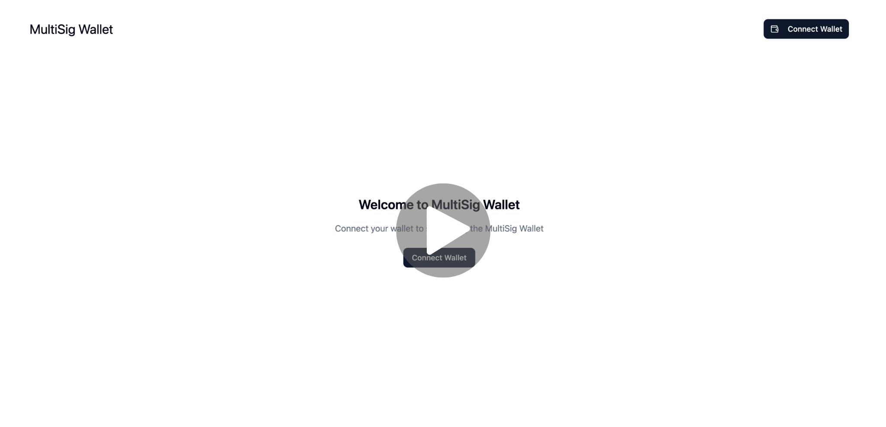

# 💰 MultiSig Wallet (EVM)
A production-style MultiSig Wallet DApp built with **Solidity**, **Hardhat**, **React + Wagmi**. \
This project demonstrates how a decentralized multi-signature wallet works, with support for:
- ✅ ETH transfers
- ✅ ERC-20 token transfers
- ✅ Executing arbitrary smart contract calls
- ✅ Owner management (add/remove owners with multi-sig approval)
- ✅ Factory contract for creating new wallets

_Deployed on Ethereum Sepolia testnet with a hosted frontend._

## 🚀 Live Demo
Frontend: [multisig.aslamthachapalli.com](https://multisig.aslamthachapalli.com/) \
Contracts (Sepolia):
- MultiSigFactory: [0x57CBe681FbfBeE93051E921797a237Bc42459d2A](https://sepolia.etherscan.io/address/0x57CBe681FbfBeE93051E921797a237Bc42459d2A)
- Example MultiSigWallet: [0x561477E09603d6476Fc5433Bb6823b5565f2Ee6a](https://sepolia.etherscan.io/address/0x561477E09603d6476Fc5433Bb6823b5565f2Ee6a)

### Watch Demo
[](https://youtu.be/LN_bBdN5nz0)

## 📖 Project Overview
A MultiSig wallet is a smart contract where multiple owners must approve a transaction before it is executed. \
This increases security for organizations, DAOs, and treasuries.

### Flow in this DApp:
1. Create a new MultiSig wallet from the factory.
2. Add multiple owners and set the required number of confirmations. 
3. Owners can:
   - Deposit ETH to the wallet.
   - Submit a transaction.
   - Approve or revoke approval.
   - Execute transaction once enough confirmations are collected.
5. Owners can also propose adding/removing members — which itself requires approvals.

# ⚡ Local Setup
### 1. Clone the Repo
### 2. Install Dependencies
### 3. Deploy Contracts to Hardhat local chain.
#### 3.1. Run Hardhat Node
Open Terminal 1
```
npx hardhat node
```
- This will start a local test chain in your machine.
- This Hardhat local chain will give 20 test account addresses with 10,000 ETH each.
- Add your preferred number of accounts to your metamask wallet for better interaction with the dapp.

#### 3.2. Deploy contract to the local chain
Open Terminal 2
```
npx hardhat ignition --network localhost deploy ignition/modules/MultiSigFactory.ts
```
- This will deploy the MultiSigFactory contract to the local chain.
- Copy the deployed contract address displayed in the terminal.
### 4. Add Environment Variables (Frontend)
```
cd frontend
cp .env.example .env
```
- Add the Envs in you .env file.
```env
VITE_ETH_SEPOLIA_RPC=http://localhost:8545 # To connect with the hardhat local node.
VITE_MULTISIG_FACTORY_ADDRESS=0x... # Add your copied contract address from Hardhat local chain.
```
### 4. Run Frontend
```
cd ../frontend
npm run dev
```
Visit [http://localhost:3000](http://localhost:3000) 🚀

## ⭐️ Show Your Support
If you found this project helpful, please ⭐️ the repo!

